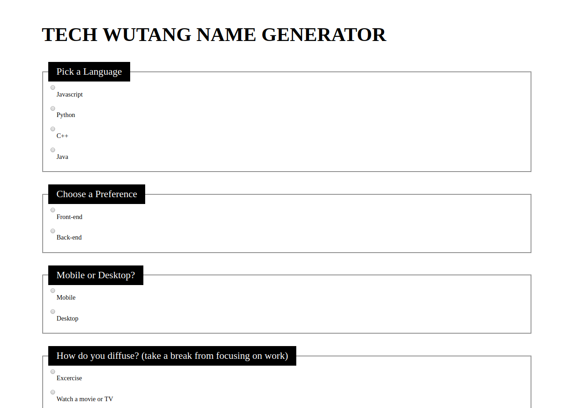

# 🎤 Wu-Tang Name Generator

### Wu-Tang Clan name generator. Present the user with 5 survey questions and based on those answers randomly generate their name. The name doesn't have to be exact names, but Wu-Tang sounding-ish names. Ex: Childish Gambino (who actually got his name from a Wu-Tang name generator).

**LINK TO PROJECT** https://angry-hypatia-b29351.netlify.com

## How It's Made:

**Tech used:** HTML5, CSS3, JavaScript, Object Oriented Programming.

## Lessons Learned:
Learned more about the form submit request and how to retrieve user data in Javascript from the DOM. Also challenged myself to create logic behind all the input questions.

## Examples:

**Weather API** https://github.com/ericamendez/weather-api-bootcamp2018c-week07

**Card Memory Game** https://github.com/ericamendez/matching-card-bootcamp2018c-week08/tree/answer

**Complex NASA API** https://github.com/ericamendez/complex-nasa-bootcamp2018c-week07
